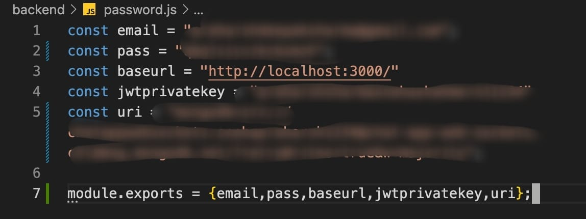
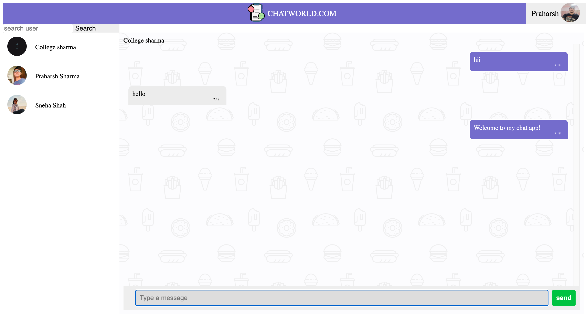
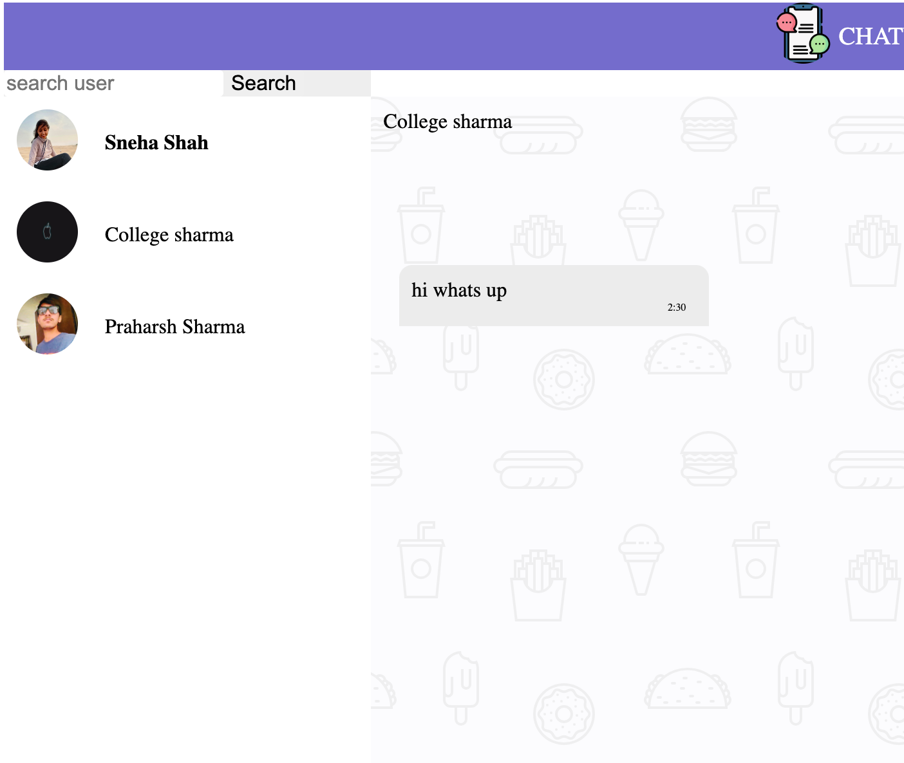
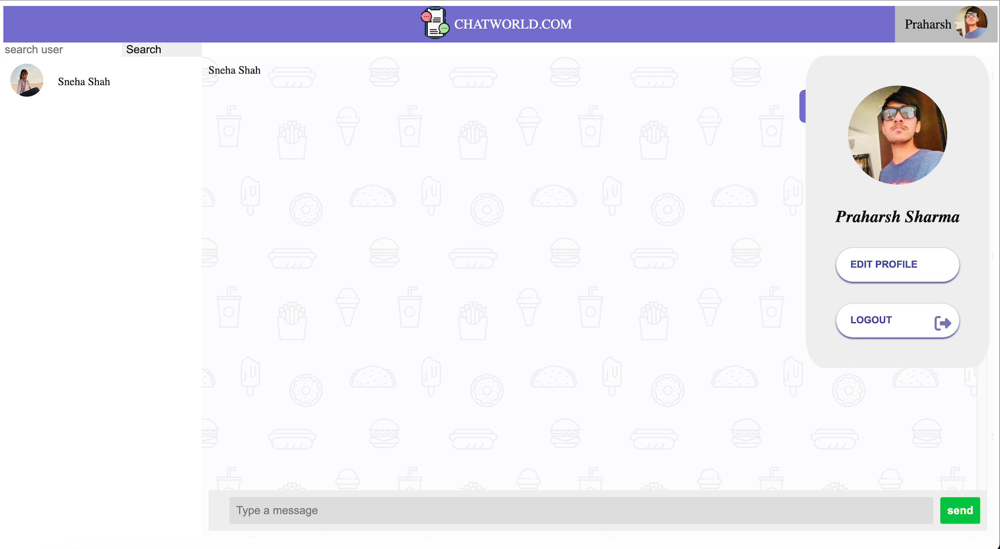

# Real-Time Chat Application

# 🧭 Table of contents

- [Real-Time Chat Application](#real-time-chat-application)
- [🧭 Table of contents](#-table-of-contents)
- [Introduction](#introduction)
- [Quick Start](#quick-start)
- [Frontend](#frontend)
- [Backend](#backend)
- [Database](#database)
- [Future Aspirations for this App](#future-aspirations-for-this-app)

# Introduction

It is a secure, scalable and feasible application that provides an interface for multiple users chatting at the same time.

# Quick Start 

📄 Clone or fork this repo :
`https://github.com/praharshsharma/MERN1.git`:

```sh
git clone https://github.com/praharshsharma/MERN1.git
```
Create a password.js file in backend folder<br><br>
<br>
- email -> Enter the email id from which the verification mail would be sent
- pass -> Generate app password for the above entered email id
- jwtprivatekey -> any string
- uri -> your database uri

💿 Install all dependencies:

```sh
npm install
```

🚴‍♂️ Run your App:

```sh
cd backend
nodemon server.js

or

npm start

```
It runs on the browser with localhost 3000.
```sh
http://localhost:3000/
```

# Frontend

 - HTML<br>
 - CSS<br>
 - Javascript<br><br>
 <br><br>
 <br>
 - Chat list shuffles according to the latest messages<br><br>
 <br>
 - User can edit his/her profile

  
# Backend

  At the `Backend` of this App, A `Nodejs` server is running, which manages all the `requests` and `responses` from the user. 
This App Uses Some Node_Modules in order to work properly which include:
- `Mongoose`
  - To make requests from the backend to MongoDB
- `cors`
    - allows a server to indicate any origins other than its own from which a browser should permit loading resources.
- `Express`
  - create a web-server
  - handles request and response
- `JSON Web Token`
  - To create cookies and tokens
- `bcrypt`
  - To convert passwords into a fixed-length character called hash to store it in encrypted form in the database.
- `nodemailer`
  - To send a verification mail to the user.
- Used the `Socket.io` module for a two-way connection between client and server.
- For end-to-end encryption here we are not storing the messages and hence when the page reloads all the chats disappear.

# Database

We are using `MongoDB` for all its database needs. This App uses DB to:
 
 - Store tokens for email verification when the user first-time signs up.
 - Store information regarding the user.
 - Stores the password of the user in encrypted form. 
 - Storing and updating cookies so that the user does not have to log in every time.
 - Storing and updating the socket ID of the users for them to chat privately.

# Future Aspirations for this App

There are some features that can be added in the future:
- Store the users' chat without compromising their privacy.
- Add audio and video call options.
- Facility to create chat rooms or groups.
- Profile pictures and about the user section to make it more user-friendly and interactive.
 